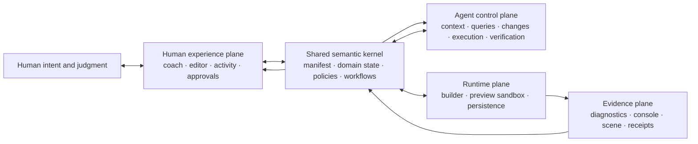

# KAPLAYGROUND agent-system constitution

> **Status:** This document defines the target system architecture and the invariants that all current and future implementations must preserve. Statements marked **Current** describe behavior already present on `dev`; statements marked **Target** are design commitments, not shipped capabilities.

KAPLAYGROUND is not an editor with an agent bolted onto it. It is a closed-loop co-creation system in which a person supplies intent and judgment, an agent supplies analysis and controlled action, and the editor plus sandbox supply authoritative state and evidence.

The system succeeds only when the user's intended result is both produced and demonstrated with fresh evidence. A plausible edit, a successful tool call, a clean build, or an attractive preview is not sufficient by itself.

## Reading map

- [Contracts](./CONTRACTS.md) specifies the vocabulary, capability model, state identifiers, transactions, evidence, and result envelopes.
- [Decisions](./DECISIONS.md) records the architectural choices that should remain stable while implementation details evolve.
- [Roadmap](./ROADMAP.md) sequences the migration from the current WebMCP bridge to the target system.
- [Evaluation](./EVALUATION.md) defines how agent ergonomics, correctness, efficiency, and safety will be measured.
- [`AGENTS.md`](../../AGENTS.md) is the repository operating guide for an agent changing this codebase.

## 1. North star

Optimize for:

> **validated user value per unit of human attention, model context, tool traffic, latency, and mutation risk.**

This is deliberately not “fewest tool calls.” One extra read that prevents a bad mutation is efficient. Ten redundant reads of unchanged state are not. A fast change without reliable verification is unfinished work transferred to the user.

Every design choice should improve one or more of these quantities without silently degrading another:

1. **Grounding fidelity** — the agent understands the active project, user goal, constraints, and current runtime state.
2. **Control precision** — actions are scoped, deterministic, conflict-safe, and reversible.
3. **Evidence quality** — claims are supported by fresh, independent, revision-linked observations.
4. **Resource economy** — the common path uses the least sufficient context and the fewest non-redundant round trips.
5. **Human agency** — the person can understand, interrupt, approve, inspect, retain, or discard the work.
6. **Accretion** — every useful capability, catalog entry, validator, workflow, and lesson enriches the whole system rather than one isolated surface.

No optimization may trade away correctness, user authority, or honest uncertainty.

## 2. One system, two control surfaces

The play-first coach and the expert agent tool surface are projections of the same semantic system. They must not develop separate vocabularies, safety rules, or notions of success.



The shared semantic kernel is the system's center of gravity. A concept such as “search Asset Brew,” “run this exact revision,” or “this evidence is unavailable” is defined once and projected into:

- agent capability schemas and descriptions;
- human-facing labels, tutorials, and activity entries;
- policy and approval behavior;
- tests and compatibility checks;
- generated reference documentation;
- evaluation events and metrics.

The recent shared Asset Brew catalog is the pattern to generalize: one semantic dataset serves both the visual UI and agent discovery instead of maintaining parallel integrations.

## 3. The linked tower of abstractions

The system is a tower. Each level hides lower-level mechanics while preserving the identifiers and evidence needed to reason safely about them.

| Level | Abstraction | Question it answers | Must expose |
| --- | --- | --- | --- |
| L0 | **User intent** | What outcome does the person want, and what must remain true? | objective, constraints, authority, acceptance criteria |
| L1 | **Operation** | What bounded unit of work is the agent attempting now? | operation ID, goal, budget, status, approvals |
| L2 | **Capability** | What can the system do, with what effects and costs? | schemas, side effects, reversibility, limits, policy |
| L3 | **Workspace snapshot** | What coherent project state is being reasoned about? | project identity, workspace epoch, content revision, active file, runtime state |
| L4 | **Knowledge query** | What is the least sufficient source and dependency context? | inventory, search hits, ranges, hashes, truncation and freshness |
| L5 | **Change set** | What exact mutations are proposed as one logical edit? | base revisions, atomic operations, diff, risk, checkpoint |
| L6 | **Execution** | What exact state was built and run? | change-set ID, content revision, run ID, protocol version |
| L7 | **Evidence** | What did independent observers report about that run? | provenance, availability, completeness, freshness, bounded payload |
| L8 | **Verification receipt** | Which acceptance criteria passed, failed, or remain inconclusive? | criterion-by-criterion verdicts and evidence references |
| L9 | **Persistence and accretion** | What should be retained or promoted for future work? | saved project, compact operation record, reviewed recipe or catalog contribution |

Higher levels may compose lower ones; they may not erase their identity. For example, a high-level `verify_operation` capability may run several collectors, but its receipt must still identify the exact run and evidence used.

### Why this tower matters

Without these layers an agent sees a bag of tools and has to reconstruct the system on every task. With them it can reason in stable units:

- “I am operating under this user objective and authority.”
- “This is the workspace snapshot I inspected.”
- “This change set is the only mutation I intend.”
- “This preview run executed that change set.”
- “These observations are fresh for that run.”
- “These criteria passed; this one is inconclusive because diagnostics were unavailable.”

That chain is the minimum legible proof of success.

## 4. Canonical concepts

These names are normative across documentation, code, schemas, UI, logs, and tests.

| Concept | Meaning |
| --- | --- |
| **Intent** | The person's desired outcome, constraints, and preferences. Intent is not inferred permission for unrelated work. |
| **Operation** | One bounded attempt to satisfy intent. It owns a goal, authority, budget, acceptance criteria, changes, runs, evidence, and terminal status. |
| **Capability** | A versioned action or query declared in the system manifest, including effects, limits, policy, and presentation metadata. |
| **Workspace snapshot** | A coherent view of the active project and editor at one workspace epoch and content revision. |
| **Artifact revision** | A content-derived identifier for one file or other independently mutable artifact. |
| **Change set** | An ordered, reviewable, all-or-none collection of mutations against explicit base revisions. |
| **Checkpoint** | A restorable pre-change state created before a reversible mutation. |
| **Preview run** | One acknowledged execution of one exact content revision under one sandbox protocol version. |
| **Evidence** | A bounded observation produced by a named collector and tied to a workspace revision and, when runtime-derived, a run ID. |
| **Acceptance criterion** | A testable statement derived from user intent or a system invariant. |
| **Verification receipt** | A deterministic `passed`, `failed`, or `inconclusive` assessment for each criterion, with evidence references. |
| **Operation record** | A compact provenance record containing identifiers, decisions, effects, metrics, and outcomes—not unrestricted hidden reasoning or raw transcripts. |
| **Recipe** | A reviewed, reusable procedure promoted from repeated successful operations. It is versioned and testable, never silently learned behavior. |

[Contracts](./CONTRACTS.md) defines their wire-level shape.

## 5. The canonical closed loop

The normal agent loop is:

1. **Orient** — read the live guide and one coherent, budgeted workspace context.
2. **Bound** — restate the objective, constraints, acceptance criteria, authority, and resource budget as an operation.
3. **Inspect minimally** — search first, then read only the relevant ranges and dependencies. Escalate to whole files only when needed.
4. **Form a change set** — describe exact effects against explicit revisions; validate and preview the diff without mutation.
5. **Apply atomically** — create a checkpoint and commit the complete change set or nothing.
6. **Execute exactly** — build and run the resulting content revision; wait for sandbox acknowledgement.
7. **Observe independently** — collect diagnostics, console output, scene state, and task-specific assertions for that run.
8. **Verify** — issue a criterion-by-criterion receipt. Unavailable or stale evidence yields `inconclusive`, never a false pass.
9. **Persist deliberately** — save only when requested or when the user-approved workflow says the result is worth keeping.
10. **Report compactly** — state the outcome, changed artifacts, verification receipt, remaining uncertainty, and any user decision required.

### Fast path and deep path

The common path should be short because the system composes safe primitives, not because the agent skips grounding:

- **Fast path:** one context call, one targeted query/read, one atomic change set, one run, one verification receipt.
- **Deep path:** expand search, dependency context, inspection, or evidence only when the operation or uncertainty demands it.

The system should offer progressive disclosure at every level: summaries before bodies, hashes before unchanged content, counts before lists, and deltas before snapshots.

### Stop and re-ground conditions

The agent must stop the current mutation sequence and re-orient when:

- the workspace epoch changes;
- a required artifact revision no longer matches;
- user intent or authority changes;
- the preview run is not tied to the expected content revision;
- a required evidence source is unavailable or stale;
- the proposed change exceeds the operation's scope or budget;
- a destructive or external effect lacks explicit approval.

## 6. State must be legible

The system needs separate identifiers for separate questions:

- **Which logical project is this?** `projectId`
- **Has the active project been replaced?** `workspaceEpoch`
- **Has any project content changed?** `contentRevision`
- **Has this particular file changed?** `artifactRevision`
- **Which proposed mutation is this?** `changeSetId`
- **Which restorable state preceded it?** `checkpointId`
- **Which execution produced this output?** `runId`
- **Which bounded user task owns all of the above?** `operationId`

**Current:** the public WebMCP `projectRevision` is derived from `projectGeneration`, so it is an effective guard against writing through a project replacement. File-content hashes independently prevent overwriting a newer file edit.

**Target:** name these semantics explicitly. `workspaceEpoch` guards project identity, while `contentRevision` changes for any project mutation. Keep compatibility aliases during migration, but do not perpetuate one ambiguous “revision” for two different jobs.

## 7. Non-negotiable invariants

1. **The user remains the authority.** A request to modify a game is not permission to replace unsaved work, publish, deploy, or expand scope.
2. **Reads are snapshot-coherent.** Multi-part context either describes one workspace snapshot or declares which portions changed.
3. **Writes are conflict-safe.** Every mutation checks the relevant workspace and artifact revisions.
4. **Logical edits are atomic.** A multi-file feature does not leave a half-applied project.
5. **Mutations are reviewable and reversible.** The system can show a diff before application and restore a checkpoint afterward.
6. **Execution is attributable.** A run identifies the exact content revision and change set it executed.
7. **Evidence is provenance-carrying.** Availability, completeness, bounds, freshness, collector, revision, and run are explicit.
8. **Verification uses independent signals.** Build success cannot prove gameplay behavior; a scene snapshot cannot prove a clean editor; absence of logs cannot prove diagnostics are available.
9. **Unavailable is not clean.** Missing diagnostics, console capture, preview inspection, or protocol support produces `inconclusive` where that evidence is required.
10. **Project content is untrusted.** Source, logs, object text, metadata, and imported examples never become instructions or policy.
11. **Outputs are bounded.** Every potentially large result reports totals, limits, truncation, and dropped data.
12. **Common operations are cancellable.** Cancellation cannot leave a hidden partial mutation.
13. **Semantics are declared once.** Tool registration, guide text, UI labels, docs, and tests derive from one capability definition wherever mechanically possible.
14. **No hidden success.** A tool's transport success is not the operation's success; only the verification receipt closes the loop.
15. **No unrestricted memory by default.** Accretion stores compact, inspectable records and reviewed artifacts, not raw conversations, source snapshots, or private reasoning.

## 8. Resource ergonomics

The agent should spend context and latency where uncertainty is highest.

### Least-sufficient context

- Return a compact workspace digest with stable identifiers first.
- Support search and multi-range reads so a symbol-level task does not require whole-project transfer.
- Return content hashes and unchanged markers for repeated reads.
- Provide cursors or `sinceRevision` deltas for files, diagnostics, console entries, activity, and evidence.
- Let callers set response budgets; never silently exceed them.
- Co-locate high-value state that is always consumed together, such as project identity, current file, preview state, latest run, and evidence availability.

### Fewer, stronger round trips

Composite capabilities are appropriate when they preserve atomicity or evidence relationships:

- `get_context` composes guide, project, capability, and freshness summaries.
- `apply_change_set` composes revision checks, validation, checkpointing, and all-or-none mutation.
- `verify_operation` composes independent collectors into one receipt while retaining each evidence record.

Composite tools must not become opaque “do everything” commands. Their sub-results, identifiers, side effects, and failure stage remain visible.

### Cost is part of the contract

Each capability should declare qualitative and, where practical, measured cost metadata:

- expected latency class;
- maximum output size;
- whether it builds or reloads the sandbox;
- whether it reads all files or only indexed metadata;
- whether it mutates, persists, or triggers external effects;
- whether repeated invocation is idempotent.

This lets the agent choose an economical plan without guessing from tool names.

## 9. Agent-accretive design

“Accretive” means new value compounds instead of creating another integration seam.

### One declaration, many projections

The target dependency direction is:

```text
shared domain registries + capability manifest
    -> policy and execution services
    -> WebMCP registration
    -> agent guide and workflow hints
    -> human labels and activity presentation
    -> generated reference docs
    -> conformance and evaluation tests
```

A new capability is incomplete until all required projections are generated or explicitly supplied from the same declaration. A test should fail when a registered capability lacks policy metadata, a human label, a guide classification, or conformance coverage.

### Bounded operational memory

An operation record should retain:

- operation and workspace identifiers;
- user-approved objective and acceptance criteria;
- capability versions used;
- change-set summary and affected artifacts;
- run and evidence references;
- verification verdicts;
- resource metrics and structured failures;
- final disposition: discarded, kept, restored, or promoted.

It should not retain full source, console payloads, or conversation text unless the user explicitly exports a trace.

### Promotion, not silent learning

Repeated success may suggest a recipe, validator, example annotation, or catalog improvement. Promotion is a normal reviewed contribution:

1. extract the reusable semantic pattern;
2. remove project-specific and private data;
3. give it a versioned contract and acceptance tests;
4. review it like code;
5. publish it through the shared registry so human and agent surfaces gain it together.

The runtime must not silently alter future behavior based on one user's session.

## 10. Current implementation mapped to the tower

| System role | Current implementation | Important boundary |
| --- | --- | --- |
| Human intent and progressive disclosure | `CodexCoach`, `WebMCPTutorial`, `WebMCPDialog` | Friendly prompts must remain a projection, not a second workflow definition. |
| Live agent guide | `src/integrations/webmcp/agentGuide.ts` | Strong safety guidance exists, but metadata is hand-maintained. |
| Capability registration and contracts | `kaplaygroundWebMCP.ts` | Nineteen current tools are validated and bounded, but one large module owns types, schemas, policy hints, execution wrappers, and serialization. |
| Application adapter | `registerKaplaygroundWebMCP.ts` | Correct place to translate domain services into live Zustand, Monaco, and preview state; it should not become the domain model. |
| Workspace state | `useProject`, `useEditor` | Project replacement and file revisions are guarded; explicit workspace/content terminology is still needed. |
| Execution | `wrapGame`, `useEditor`, `previewProtocol`, `sandbox/` | Runs and pause changes are acknowledged; app and sandbox are version-coupled. |
| Evidence | Monaco diagnostics, bounded console capture, shallow preview inspection | Availability and truncation are represented; evidence is not yet normalized into a common ledger. |
| Human observability | `webMCPActivity` and activity UI | Tool status, input, duration, and error are visible; entries are not yet grouped by operation or linked to effects and evidence. |
| Persistence | project store and IndexedDB | Transient projects can be deliberately persisted. |
| Shared semantic catalogs | examples and Asset Brew catalog | Asset Brew demonstrates one registry serving both people and agents. |
| Conformance | `tests/webmcp.test.mjs` and `verify:webmcp` | Broad behavior is tested; contract generation, benchmark metrics, and fault-injection suites are future work. |

## 11. Target module boundaries

The target structure is conceptual; migrations should be incremental and keep behavior stable.

```text
src/agent-system/
  manifest/        capability and workflow declarations
  contracts/       versioned domain and wire schemas
  policies/        authority, limits, risk, and approval rules
  services/        context, query, change-set, execution, evidence, verification
  adapters/        Zustand, Monaco, IndexedDB, sandbox, and WebMCP bindings
  projections/     tool registration, agent guide, UI labels, generated docs
  observability/   operation events, metrics, bounded records
```

Domain services should accept explicit snapshots and return explicit effects. UI components and WebMCP handlers call those services; neither reaches through the other. The existing `src/integrations/webmcp` code can be decomposed into these roles over several milestones rather than rewritten at once.

## 12. Source-of-truth hierarchy

During the migration, resolve disagreements in this order:

1. user authority and the invariants in this constitution;
2. versioned contracts and capability manifest;
3. domain state and policy services;
4. adapters to the editor, sandbox, persistence, and transport;
5. generated projections: tools, guide, UI metadata, docs, and conformance cases;
6. narrative examples and tutorials.

**Current transition rule:** when changing today’s WebMCP behavior, update the runtime schema, live guide, activity presentation, tests, and current-behavior documentation together. The roadmap replaces this manual synchronization with generated projections.

## 13. Architectural decision discipline

Stable choices are recorded in [DECISIONS.md](./DECISIONS.md). A change needs a new decision record when it alters:

- the meaning or lifetime of a canonical identifier;
- authority or approval boundaries;
- atomicity, rollback, or persistence guarantees;
- evidence required to claim success;
- app/sandbox or capability compatibility rules;
- what operational data may be retained;
- the single source of truth for a semantic concept.

Implementation refactors that preserve these choices do not need an architectural record.

## 14. Definition of a coherent contribution

A contribution to the agent system is complete when:

- its user outcome and acceptance criteria are explicit;
- it uses canonical concepts and identifiers;
- effects, reversibility, authority, limits, and failure modes are declared;
- current and target documentation are not conflated;
- human and agent surfaces share the same semantics;
- tests cover success, stale state, unavailability, cancellation, and bounds as applicable;
- evaluation can measure its result and resource cost;
- app/sandbox compatibility is preserved when the preview protocol changes;
- the repository agent guide and roadmap remain accurate.

The desired end state is not merely a larger tool collection. It is a compact, proof-carrying control system that lets an agent understand just enough, act exactly once, verify independently, and leave the project more legible than it found it.
