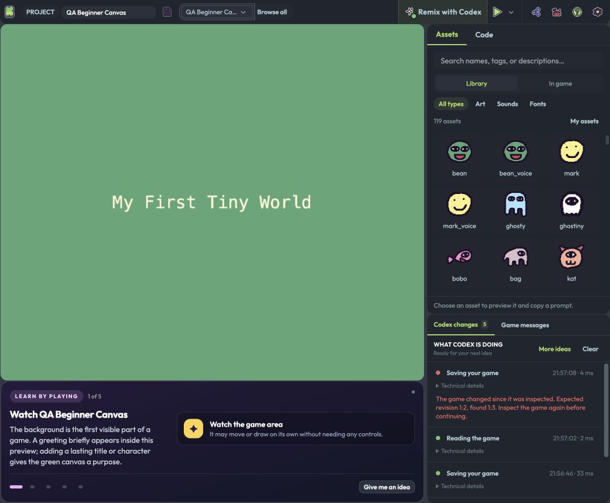
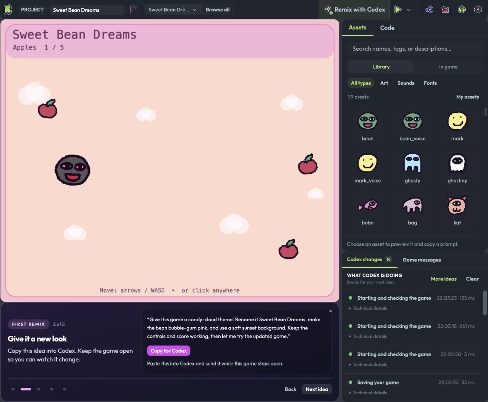
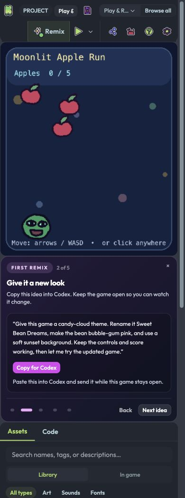
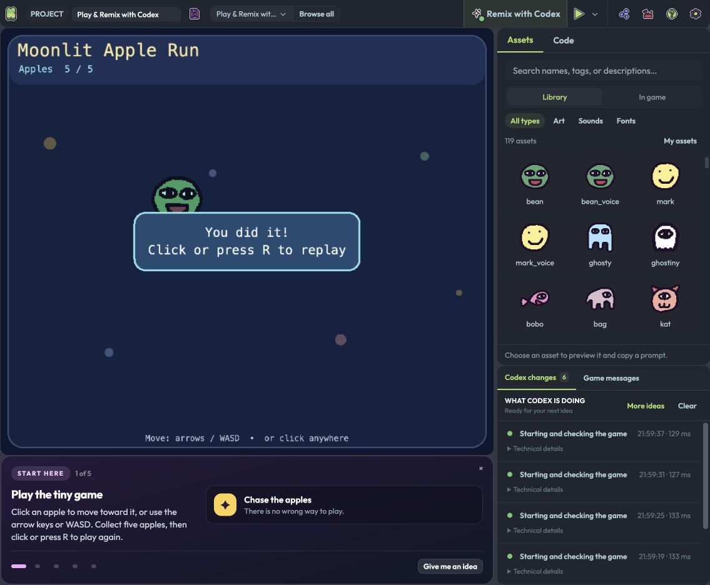
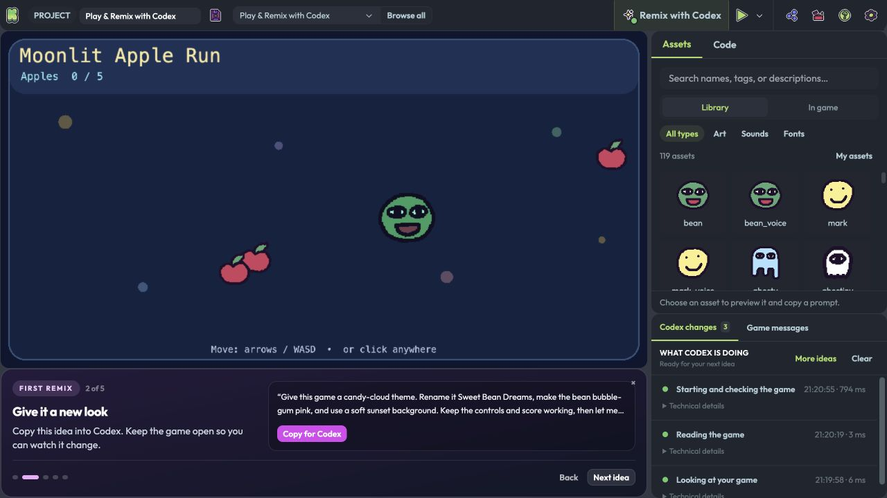
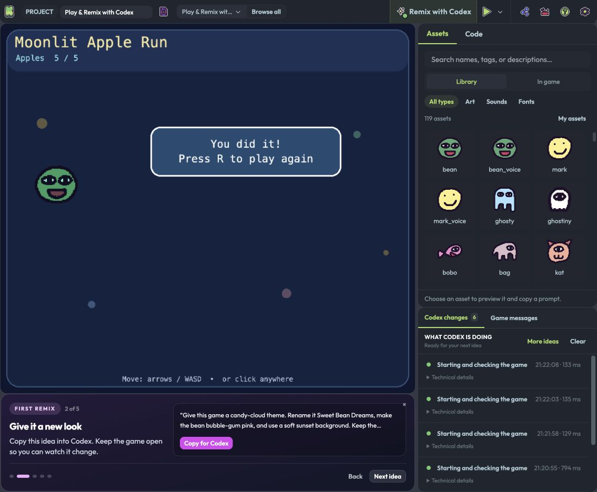
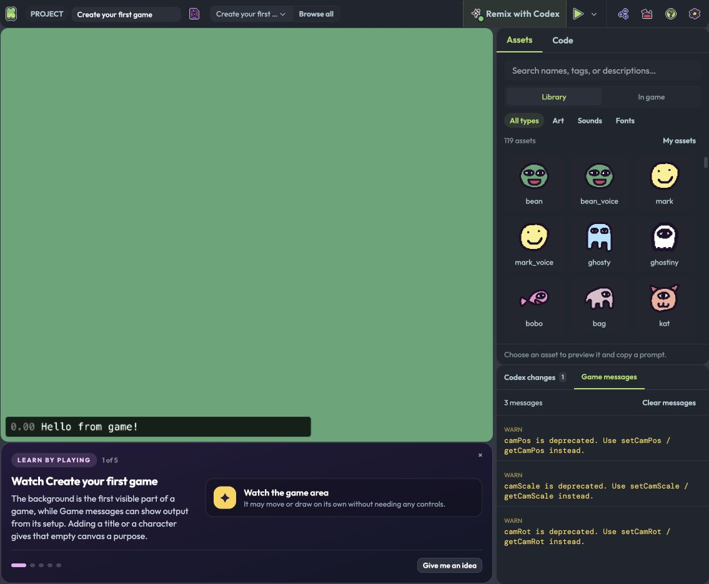

# KAPLAYGROUND end-to-end test report

Test date: 2 September 2026. Source baseline: `5e557d8a4a00b8ca52946721bcf29e5ecf19b612` on `dev`.

The repaired project passes the end-to-end checks: **67 unit tests, all 127 sample startups, and all 508 prompt-copy mappings**. Native WebMCP checks also confirmed edits, runs, saves, reopening, and representative gameplay. These results cover deterministic behavior and two executed prompt scenarios; they do not mean that every possible generated remix was evaluated.

## Results and scope

The original 66 unit tests and existing browser suite passed. A broader catalog audit found that **125 of 127 starting points started successfully**, while **all 508 copyable prompts were connected to the expected buttons**. The two startup failures were Advanced Bindings and Custom Loading Screen. Additional review found inaccurate lessons and weaknesses in clipboard failure handling, keyboard focus, and delayed copy feedback.

The coach uses a **copy → paste into Codex → send → update → run → play** workflow. Clicking **Copy for Codex** copies the suggestion; it does not submit a request or execute a change. The updated coach makes the paste-and-send step explicit. Its four suggestions per sample are correctly wired, but this report does not claim that 508 independent AI-generated games were built and played.

Coverage uses three complementary methods:

1. **Automated application tests.** Node tests cover revisions, atomic edits, limits, persistence, diagnostics, sandbox messages, and prompt coverage. The browser suite runs the application, Monaco, compiler, real preview iframe, and game engine in an isolated Chromium profile. Its WebMCP registration host and clipboard success/failure responses are controlled test fixtures.
2. **Complete catalog audit.** Every starting point is opened through the chooser. Each of its four suggestions is selected and copied, and the test verifies the exact copied text, startup state, and absence of unintended edits, saves, or restarts.
3. **Native browser checks.** Codex Browser discovers and calls the page's actual WebMCP tools. Representative sample instructions, file changes, game runs, project saving, visible output, and gameplay are checked separately from the fixture. The built editor and built sandbox are also served locally for a production-bundle smoke test.

The environment was macOS with Node `v26.4.0`, npm `11.10.0`, KAPLAYGROUND `2.5.3`, and Vite `8.2.2`. Local development used separate editor and sandbox origins. The automated suite substitutes locally installed engine and compiler binaries for their CDN downloads; native checks use the normal hosted engine. That difference exposed the loading-screen compatibility defect described below.

All eight native tools were exercised: `kaplayground_inspect_game`, `kaplayground_read_files`, `kaplayground_update_game`, `kaplayground_run_game`, `kaplayground_find_assets`, `kaplayground_save_game`, `kaplayground_find_examples`, and `kaplayground_open_example`. Their negative cases and data bounds receive the broader automated coverage listed in the test matrix.

## Fixes

| Finding | Before | Change and verification |
| --- | --- | --- |
| Advanced Bindings could not start | Its loop constructs `/crew/${friend}.png`. The compiler embeds literal library paths, but computed paths reached the sandbox as HTTP requests and returned HTML instead of images. Native WebMCP also reported failure. | Generate the library's 234 declared media files and serve them at `/crew/` in both builds. Route checks compare bytes, not just HTTP 200. The regular browser suite now starts this sample. |
| Custom Loading Screen failed with the checked-out engine | The sample stored raw sprite data and passed it to `drawSprite`. The checked-out engine accepts an asset handle there; the hosted engine also accepted the raw data, so native and fixture results differed. | Adapt this sample to retain its asset handle and use a same-site asset for its managed fetch. Preserve the upstream submodule. The normal browser suite now starts the sample with the checked-out engine. |
| Copy lost keyboard focus | Copying focused a temporary textarea, removed it, and left focus on the document body. A new regression failed against the original implementation. | Restore the previously focused element after copying. Verify both the bottom coach and the modal. |
| Modal copying selected an inert element | The temporary textarea was appended outside the open modal, where browsers prevent focus. | Insert the temporary field inside the active dialog. Verify its location, selected value, and restored button focus. |
| Clipboard exceptions skipped the fallback | A throwing legacy copy call escaped before the asynchronous clipboard API could run. | Fall back after either a false result or an exception, and clean up the timeout after completion. Test the thrown-error path. |
| Clipboard failure did not provide a usable recovery path | The button said to select the idea, but the coach clipped long prompts and did not expose a selected field. | Show a read-only textarea containing the complete prompt, focus and select it, explain manual copying, and provide a retry button. Test denied clipboard access. |
| Late copy responses could label the wrong idea | A pending copy could finish after the user moved to another suggestion and show “Copied” on that new suggestion. | Associate feedback with its request and invalidate it on navigation or unmount. Test a deferred clipboard response after moving to the next idea. |
| Long prompts were hidden | The compact coach displayed only two lines, so users could copy instructions they had not been able to read in full. | Display the entire suggestion, wrap long text, and retain the explanation beside it. Check desktop and portrait layouts. |
| Several lessons described different behavior from their samples | Examples included a disabled missing-image load described as active, a stopping patrol described as looping, and a maze click described as generation. | Correct nine explanation prompts and five lessons. The precise changes are listed below. |
| Inspection polluted the game's warnings | Every inspection called deprecated camera aliases and produced three warnings even for a clean game. | Prefer the modern camera getters and retain fallbacks for older engines. The new regression failed before the change and passes afterward. |
| The starter required a keyboard to replay | Pointer users could collect all five apples, but the victory screen only offered R to restart. | Share one restart function between R and clicking after a win, update the victory instructions, and use a proper color value for the victory outline. Native clicks reached 5/5 and then reset the score to 0/5 in the same preview run. |
| Starter naming and presentation were inconsistent | Welcome and README named a different game; examples using visible debug output could be described as output-only. | Name Moonlit Apple Run consistently and recognize the visible greeting/FPS display when selecting the coach presentation. |

The coach's small progress indicators also have larger hit areas and visible keyboard focus. These changes keep the existing eight-tool integration and do not add a separate agent service or prompt submission system.

## Prompt and lesson review

Every generated example has four distinct suggestions: explanation, remix, a small game, and a personalized idea. The starter has its own four-step remix sequence. Automated checks enforce complete catalog coverage, bounded prompt length, and the absence of browser-routing syntax, tool names, revision language, and other integration jargon in user-facing prompts.

| Sample | Corrected guidance |
| --- | --- |
| The KAPLAY Context | Explain the `k` variable and disabled global names; identify the greeting inside the preview. |
| Create your first game | Identify the green canvas and the greeting inside it, then ask for a lasting centered title. The original “Game messages” location was wrong. |
| clicktopmost | Look for the clicked rectangle's name inside the preview. |
| Lerp | Explain mode 1's pointer following and mode 2's centered, hover-sensitive bean, including its click-to-grow reaction. |
| Custom Loading Screen | Watch the circular indicator and deliberate one-second wait; Space plays a sound. It does not advance to another scene. |
| Maze | Click an open cell to choose a destination; the maze is generated at startup. |
| Load Error | State that the broken load is commented out. Ask to enable it, observe the throwing handler, and then implement a recovery path. |
| Patrol | Follow the four waypoints, stop at the last, and observe the completion message before requesting a repeating route. |
| Timer | A bean appears every half second and disappears three seconds later. The explanation now describes those two timers directly. |

The ideas generally form a useful progression from observing one mechanism to changing its presentation and then building a small game around it. The personalized ideas intentionally contain bracketed choices; their accompanying instructions tell the user to replace those choices before sending.

## Test matrix

| Area | Checks and evidence |
| --- | --- |
| Fresh startup | Starter opens as an unsaved draft, Assets is selected, one Monaco instance is mounted, and starting a game does not create a saved project. |
| WebMCP discovery | Exactly eight tools, complete schemas and trust annotations, lifecycle registration, cancellation, and rollback after partial registration failure. Native discovery also confirmed eight tools. |
| Inspect and read | File metadata pagination, exact multi-file reads, stale revisions, missing files, aliases, traversal, duplicate paths, and aggregate size bounds. |
| Atomic edits | Validate all changes before committing; invalid multi-file changes preserve the original map. Native testing confirmed an invalid path left the revision and running preview unchanged. |
| Editor synchronization | Updated and removed files synchronize with Monaco; hidden Code remains hidden; synchronization failures are distinguished from a committed update. |
| Run and check-current | Readiness, diagnostics, console errors, object snapshots, focus, and revision checks are returned separately. Checking the current run preserves gameplay. |
| Failed and incomplete runs | Code/console errors produce failure; missing diagnostics, bounded output, pending assets, or unavailable scene checks remain incomplete. |
| Sandbox message boundary | Reject wrong origins, wrong iframe windows, stale runs, malformed messages, and oversized data. Console capture remains active without WebMCP. |
| Asset discovery | Library, uploaded, and runtime assets; exact runtime names; sprite dimensions and sliced frames; bounded output; no source URLs or binary payloads in tool results. |
| Asset serving | App and sandbox routes return the expected sprite, sound, font, and generated Crew bytes rather than a successful HTML fallback. |
| Saves and projects | Explicit draft save, first-edit autosave, rapid edits, failed-write retry, pending-navigation flush, legacy projects, reopen, and deletion-queue behavior in isolated test storage. |
| Example replacement | Current revisions are required; pending saves finish first; declining the in-page discard prompt preserves the active project. |
| Coach navigation | Initial explanation, next/back controls, direct step buttons, collapse/reopen, context switching, and shared progress between the bottom coach and modal. |
| Coach copy behavior | Exact text for every idea; legacy and asynchronous clipboard paths; thrown legacy call; denied copy; full selected manual fallback; delayed response after navigation; focus inside and outside dialogs. |
| Coach side effects | Reading, copying, or collapsing ideas does not change the project, start the preview, or create a saved project. |
| Catalog | 127 starting points and 508 copied suggestions. All playable starters and the two repaired feature examples are also covered by the normal browser gate. |
| Responsive workspace | Desktop at 1042×936 and 1440×1000, portrait at 390×844, keyboard resizing, aligned panels, no horizontal page overflow, and preservation of the active run. |
| Browser dialog | Desktop/portrait fit, scrollable content, visible footer, search and destination tabs, and keyboard navigation. |
| Starter gameplay | Native pointer input collected all five apples and reached the win screen; R restarted the original sample. The updated pointer replay is checked separately below. |
| Build | TypeScript check, sandbox production build, main production build, supported output entrypoints, and generated asset files. |

## Verification record

| Check | Final result |
| --- | --- |
| `npm run test:webmcp` | 67 tests in 14 suites passed; zero failures. The baseline had 66 tests. |
| `npm run verify:webmcp` | Exit 0 after the final code edits. Includes the unit tests, TypeScript, browser integration, sandbox build, and editor build. |
| Regular browser integration | Passed, including 14 playable starters, the two repaired feature samples, clipboard recovery, focus, delayed-copy handling, revisions, persistence, and responsive layouts. |
| `WEBMCP_CAPTURE_UI=1 npm run test:catalog` | Exit 0; 127/127 samples ready, no recorded startup or console errors, 508/508 exact prompt copies. The command now fails if any catalog row fails. |
| Local production build | Built with `VITE_SANDBOX_URL=http://127.0.0.1:5374/`; served the editor at port 5373 and sandbox at 5374. Native starter and Advanced Bindings runs passed. The final verification rebuilt the ordinary configuration afterward. |
| Built asset routes | Eight byte comparisons passed: four representative Crew sprite, outline, sound, and bitmap-font files through each of the built editor and sandbox origins. |
| Responsive checks | Automated layouts passed at 1042×936, 1440×1000, and 390×844. The native built page also returned `scrollWidth: 390` at a 390×844 viewport with the full prompt present. |
| `git diff --check` and working-tree review | Passed. Changes are limited to the fixes, supporting generation, regression coverage, documentation, and evidence. The `kaplay` submodule remains clean. |

The build still emits existing warnings about `console-feed` using direct `eval` and a large main bundle. Those warnings did not fail the gate. The native Custom Loading Screen run also retains the sample's own deprecated `volume()` warning; the inspector's three repeated camera warnings are gone.

### Actual prompt and gameplay outcomes

1. **Beginner explanation and title.** The corrected idea accurately points to the greeting inside the green preview. Following its requested edit produced a lasting, centered “My First Tiny World” title. Native `run_game` reported a rendered frame, current diagnostics with zero errors, and no console warnings. The game was explicitly saved as “QA Beginner Canvas”; reloading preserved its project ID, name, and edited source.
2. **Candy-cloud remix.** The displayed starter suggestion was implemented through `read_files` and `update_game`, then run and saved as “Sweet Bean Dreams.” The visible result has a pastel sunset palette, cloud shapes, and a pink character tint. Clicking an apple increased the score from 0/5 to 1/5 without restarting that run. This scenario was executed by the testing agent from the displayed request, rather than submitted as an independent new conversation.
3. **Starter play and replay.** Real pointer input collected all five apples. The updated victory message offered a click or R; clicking it removed the victory state and reset the score to 0/5 with the same run ID. A separate baseline check verified the existing R behavior.
4. **Feature controls and compatibility.** Advanced Bindings initially failed to load its computed image path. After the fix, a native run passed, and Tab changed the displayed character from `bag` to `bean` without restarting. Custom Loading Screen passed with both the checked-out engine fixture and the normal hosted engine.
5. **Failure boundaries.** A native invalid-path update preserved the revision and active run. Saving with an old revision was rejected. Renaming a saved game invalidated its previous run revision, so checking that old run correctly requested a restart; restarting the renamed revision passed.

### Native browser limits observed

The native copy button showed successful feedback, but the browser's virtual clipboard did not expose text written by `document.execCommand`. Exact payloads and success/failure behavior were verified in the real browser fixture with controlled clipboard responses. Independent system-clipboard paste remains unconfirmed.

On the first edit of a draft, autosaving changed the page address while the next native call awaited its browser security check. That call was rejected because its page context had changed. Refreshing the discovered tools and inspecting the saved revision allowed the workflow to continue without repeating or losing the edit. This is a remaining integration friction point for clients that retain a tool handle across the address change.

A single native ArrowRight press did not establish horizontal movement in the animation sample, so that observation is marked inconclusive in the evidence. The automated browser suite separately holds ArrowRight and asserts movement. Audio playback quality, physical gamepads, and complete gameplay for all 127 samples are outside these results.

## Evidence

- [Baseline catalog results](2026-09-02/catalog-baseline.json) contain all 127 startup and copy outcomes before the fixes.
- [Final catalog results](2026-09-02/catalog-after.json) contain all 127 successful startup and prompt-copy outcomes after the fixes.
- [Native browser evidence](2026-09-02/native-evidence.json) records the actual WebMCP responses and gameplay observations.
- [Built asset route checks](2026-09-02/built-asset-routes.json) record the eight exact byte comparisons.
- [Final verification log](2026-09-02/verification.log) includes the tests, browser result, types, and build output.
- [Desktop workspace](2026-09-02/workspace-1440.png), [portrait workspace](2026-09-02/workspace-390.png), and [portrait sample chooser](2026-09-02/browser-390.png) document the automated layout checks.

The native screenshots show the actual rendered results. The full-prompt portrait screenshot uses 390×1050 so both the game and the expanded coach fit in one image; the separate 390×844 check confirmed no horizontal overflow.

The following screenshots preserve the original behavior for comparison.

## Remaining improvements and limits

1. **Give samples explicit control descriptions.** Several first cards explain the concept but defer exact controls to the next idea. Short per-sample controls and expected results would let a beginner explore before asking Codex, especially for controller-only samples.
2. **Make engine versions reproducible.** The checked-out engine and the hosted `master` URL differ. Pinning an immutable engine release, or testing both explicitly in CI, would make sample compatibility regressions easier to reproduce. The loading-screen finding demonstrates the practical effect.
3. **Keep the complete catalog gate in CI.** The original suite could pass while two feature samples failed. `npm run test:catalog` expands coverage to every sample and all four prompt buttons.
4. **Exercise client recovery after autosaving a draft.** A native client should refresh its page tools after the first edit changes the address, then inspect the saved revision before continuing. The observed rejection preserved the edit, but interrupted an otherwise straightforward remix request.
5. **Reduce the initial bundle.** The editor build reports a main chunk of roughly 23.4 MB before gzip and 10.0 MB after gzip. Review the embedded asset catalog and module imports for loading on demand; these local functional tests do not establish acceptable cold-start performance on a slow connection.
6. **Treat generated-game quality as a separate evaluation.** Copy wiring and safe tool execution are deterministic checks; subjective visual quality and arbitrary personalized requests need representative acceptance scenarios. Physical gamepads, perceived audio quality, assistive technology, Safari, and Firefox were not exercised by this Chromium-based run.

The original audit fixes were subsequently committed as `8126599`, pushed, and deployed as Site version 27 at [the production site](https://kaplayground.logicleaptech.chatgpt.site/). That deployment includes the compatible sandbox assets and runtime.

## Follow-up: sound previews and autosave feedback

The user reported disabled library sound controls and the missing autosave option. Live inspection reproduced disabled voice and burp previews: the Crew package supplied the voices as `audio/wave` data URLs and burp as `application/octet-stream`. The longer MP3 used `audio/mpeg` and did play. All four initially displayed `0:00` because the player deferred loading until playback.

Library previews now use the existing generated `/crew/` sound files, whose responses have audio MIME types. The player loads metadata when selected, labels clips shorter than one second with their actual duration, stops playback when cleared or replaced, and provides a visible loading failure with Retry sound. The runtime sound panel shares that loading and error handling.

| Library sound | Decoded duration | Browser result |
| --- | --- | --- |
| `bean_voice` | 0.048 seconds | Metadata loaded before Play; visible Play control advanced playback. |
| `mark_voice` | 0.048 seconds | Metadata loaded before Play; visible Play control advanced playback. |
| `burp` | 0.425 seconds | Metadata loaded before Play; visible Play control advanced playback. |
| `kaboom2000` | 20.924 seconds | Metadata loaded before Play; visible Play control advanced playback. |

Autosave itself was still operating. The earlier toolbar used an “Autosave Enabled” tooltip for saved projects; its replacement only said “Save project.” The save icon now exposes “autosave on” in its accessible name and explains that changes are saved to My games in this browser. Drafts explain first-edit autosave, pending writes say autosaving, and failures retain the visible Retry action. This restores the missing explanation without changing persistence behavior.

The browser regression suite now clicks all four native Play controls and checks playback time, verifies that selecting or clearing an asset stops the previous sound, exercises a failed runtime URL and Retry sound, and confirms that selecting a working runtime clip clears the failure. Asset-route checks compare all four served files with their source bytes and require audio response types. Existing persistence checks now also assert draft, pending, and saved autosave feedback. The input driver waits for native controls to paint before clicking, avoiding an intermittent first-click failure in the initial test.

The final `npm run verify:webmcp` exited successfully: 67 unit tests, TypeScript, browser integration, sandbox build, and editor build all passed. The production sound routes also returned matching bytes with `audio/x-wav` for the voices and `audio/mpeg` for the two MP3s. Native in-app testing independently confirmed that the fixed bean voice loaded metadata and advanced to its end on Play.

These checks establish loading, decoding, playback progression, and UI recovery. They do not measure perceived sound quality or speaker output. The full 127-sample catalog was not rerun for this editor-only follow-up; the normal WebMCP verification gate still covers its 14 playable starters and two feature regressions.

## Follow-up: Project Browser motion

Comparing the original browser with the new layout identified the missing tag-drawer height animation, collapsible sections, and hover transitions. The original drawer uses a 300 ms cubic ease-out. The new browser now uses that timing when tab changes or topic expansion change the header height, while keeping the current cards, collections, search, sorting, and fixed footer. Existing game and feature sections can fold with a 200 ms slide, tab contents fade in, and cards and tab buttons transition between hover colors.

Header measurements use unscaled layout height so the dialog's opening transform cannot leave the topics clipped. A resize observer updates the target when text wraps or the viewport changes; CSS handles interrupted transitions. Collapsed sections become inert and hidden from assistive technology immediately, and reduced-motion preferences disable the added movement.

| Regression check | Result |
| --- | --- |
| Switch from starting points to My games | Header moved through 196 → 161 → 156 px. |
| Switch back to starting points | Header moved through 156 → 191 → 196 px. |
| Expand topics | Header moved through 196 → 220.5 → 224 px. |
| Collapse the games section | Content moved through 1042.75 → 206.03 → 0 px; hidden cards could not receive focus. |
| Rapid topic toggles and section reopening | Final heights matched the requested state; all cards remained present. |
| Reduced motion | Tabs and sections settled without active motion, with the correct final height and focus behavior. |
| Responsive layout and existing features | The full `npm run verify:webmcp` passed, including 67 unit tests, types, browser integration, desktop/portrait layouts, sound playback, persistence, and both builds. |

Intermediate heights come from pausing each real browser transition at its midpoint, which makes the checks independent of CI frame timing. The tests also assert that the header fits when the dialog first opens, so a modal-scale measurement error cannot pass unnoticed.

## Follow-up: resizable game workspace — September 3

The original playground uses Allotment panes that snap closed when their dividers reach an edge. In a 1135 × 936 browser window, closing the editor and console let its game fill the space beneath the toolbar. The new workspace had replaced the main split with a grid constrained to a 400 px game column and a 300 px tools column, while the tips occupied a separate block. Neither edge could give that space back to the game.

The workspace now uses the same Allotment drag and snap system for the main columns, the game and tips, and the tools and messages. Drag the main divider right to hide the tools, then drag the divider beneath the game down to hide the tips. The new Expand game button beside Run performs both actions, and Restore panels brings them back at their previous sizes. The edge handles also allow reopening by dragging inward. Hidden content is inert and excluded from the accessibility tree, and dividers expose keyboard controls and their current position.

Narrow screens retain the stacked reading order and can expand the game to the viewport. Responsive changes keep the iframe and Monaco editor mounted. An initial regression check caught the saved tools width shrinking to its minimum when returning from a narrow viewport; restoring the saved sizes after Allotment has measured the new container fixes that race. The old test that waited for a CSS grid now checks actual panel geometry, and the tips alignment check measures the pane around its scrollable content.

| Check | Result |
| --- | --- |
| Native horizontal and vertical edge drags | The tools and tips snapped closed; the game measured 1133 × 890 px beneath the 45 px toolbar in a 1135 × 936 window, leaving only the existing 1 px gutters. |
| Reopen from an edge | Dragging inward restored the tools in the in-app browser. |
| Expand and restore buttons | Passed at 1042 × 936, 1440 × 1000, and 390 × 844; expanded bounds matched the available workspace within 2 px. |
| Expand the tools instead | Dragging the main divider left hid the preview and gave the tools the full 1042 px workspace width. |
| Keyboard resizing and snapping | Arrow Left increased the tools width from 340 to 360 px; End snapped the tools and tips closed. Restore recovered the panels. |
| Window changes while expanded | The game continued filling the viewport when switching between narrow and wide sizes. |
| Saved layout | The 360 px tools width survived hiding, restoring, a fresh visit, and a return from portrait layout. |
| Running game and editor | The iframe element, Monaco instance, preview run ID, and project revision remained unchanged through the layout checks. |
| Tips and WebMCP | Hiding and restoring tips retained the selected idea; inspection correctly reported the Code panel as hidden while the game was expanded and visible after restoration. |

The final `npm run verify:webmcp` passed: 67 tests in 14 suites, TypeScript, browser integration, the sandbox build, and the editor build. Existing sound playback, persistence, prompt, Project Browser motion, reduced-motion, and starter checks remained green. The full 127-sample catalog was not repeated for this layout-only change. These checks verify panel behavior and preservation of the running preview; a sample's own positioning and resize logic still determine how its scene uses newly available space.

## Follow-up: dynamic game resizing — September 3

The Burp comparison exposed a difference left by the pane restoration: the original Allotment layout resizes panes proportionally, while the replacement explicitly disabled proportional layout. Its narrow-screen columns also had fixed 700 px and 800 px heights. Restoring the original proportional behavior lets the game, ideas, and tools grow and shrink together. Narrow-screen columns now measure their height from the available workspace beneath the toolbar, including the toolbar's two-row layout, and scroll inside that workspace when necessary.

The browser test now opens the actual Burp sample before resizing and reads the running engine's viewport through the existing preview inspection protocol. It compares those dimensions with the visible iframe after each change. This extends the earlier tests, which only established the iframe's bounds and identity. The initial regression run failed the proportional-size assertion; an intermediate mobile run caught the wrapped toolbar consuming more height than a fixed subtraction allowed.

| Check | Result |
| --- | --- |
| Desktop window changes from 1042 × 936 to 1440 × 1000 | The game column retained approximately 67.3% of the width and the ideas retained approximately 27.3% of the preview column's height, allowing for pixel rounding. |
| Burp's rendered viewport | All 18 size checks matched the game panel within the 2 px tolerance, including window changes, ordinary divider drags, snapping, and expansion. |
| Narrow window changes from 390 × 844 to 390 × 700 | The game and ideas fitted beneath the actual toolbar at both heights. The game viewport changed from 373 × 549 to 373 × 444 px; the 15 px difference from the available width is the test browser's scrollbar. |
| Narrow-window expansion | The game viewport filled 388 × 754 and 388 × 610 px respectively, with only the existing gutters around it. |
| Independent divider movement | A 60 px horizontal drag changed only the game width; a 40 px vertical drag changed only its height. Both changes reached the running engine. |
| Preservation and restoration | The iframe, editor instance, run ID, and project revision survived the layout changes. Keyboard resizing, edge snapping, previous sizes, and saved layouts remained covered. |
| Native in-app browser with the hosted engine | The game changed from 774 × 490 to 834 × 490 to 834 × 530 px through the two divider drags. Expand filled 1278 × 674 px, Restore returned to 834 × 530 px, and the Burp scene remained visible. |
| Required verification | `npm run verify:webmcp` passed all 67 unit tests in 14 suites, TypeScript, browser integration, and both builds. Existing sound, persistence, prompt, Project Browser motion, and starter tests also passed. |

The original Burp sample positions its text once when it starts. Direct comparison confirmed that the original site also leaves that text at its initial game coordinates when the panel changes size; resizing the viewport does not recenter existing objects. This fix preserves the sample's code and engine behavior. The full catalog and other browser engines were not rerun for this layout-only follow-up.

[Dynamic resize evidence](2026-09-03/dynamic-resize.json) records the dimensions and panel proportions from the final verification run, plus the native browser measurements.

## Follow-up: compact ideas and panel limits — September 3

The latest feedback corrects two behaviors in the earlier pane restoration: the tools should stay beside the game, and the ideas close button should leave the familiar compact control. The tools sidebar now stops at 45% of the desktop workspace or 560 px, whichever is smaller, and dragging or pressing Home cannot snap the game closed. The tools can still collapse to the right, and Expand game still fills the available workspace.

The ideas × now minimizes to a 40 px dock with a Show Codex ideas button. Reopening restores the previous height and selected idea, with keyboard focus moving to the available control. The tutorial stays mounted so minimizing does not discard its state. Dragging the ideas divider stops at a 140 px reading minimum; fully expanding the game remains a separate toolbar action.

The card itself now fills its pane. Its explanation and prompt scroll internally, while the footer stays visible. Moving between short and long ideas, or exposing the manual-copy fallback, cannot change the game height. Resizing the window or deliberately moving a divider still resizes the workspace as before.

| Regression check | Result |
| --- | --- |
| Five ideas at five viewport settings | All 25 checks kept the card, pane, and game heights unchanged within each setting. Card heights were 242 px at 1042 × 936, 259 px at 1440 × 1000, 204 px at 390 × 844, and 165 px at 390 × 700. Returning to desktop settled at 241 px after proportional rounding, then remained constant across all five ideas. |
| Minimize and restore | At each setting, the × left a usable 40 px dock. Show Codex ideas restored the previous height within 2 px and retained idea 5. Focus moved to Show when minimizing and back to × when restoring. |
| Sidebar boundaries | Native pointer drags and keyboard Home could not hide the game or grow the tools past the 45%/560 px limit. End could still collapse the tools, and restoring recovered the saved width. |
| Ideas divider | Dragging down stopped at 140 px and kept the card usable. Keyboard End obeyed the same minimum. |
| Clipboard denial | The complete prompt remained selectable inside the scrollable content. Showing this fallback preserved the card height and kept the navigation footer inside the pane. |
| Runtime resizing | All 28 Burp runtime viewport checks matched the visible game frame within 2 px, including minimizing, restoring, resizing the window, dragging dividers, and expanding the game. |
| Existing state | The running preview, iframe, Monaco instance, selected idea, game revision, and saved panel width survived the layout checks. |

An environment issue initially blocked the unrelated audio tests: playback stalled on this host with the default output device, including on the unchanged live page, where mark_voice remained at 0.02322 of 0.048005 seconds. The headless runner now uses Chromium's test audio output, which substitutes a fake output stream while preserving media decoding and playback timing. This behavior is defined in [Chromium's audio manager](https://chromium.googlesource.com/chromium/src/+/refs/tags/132.0.6790.1/media/audio/audio_manager_base.cc). All four sound controls then passed the existing byte, MIME, metadata, native-click, time-progression, and stop-on-selection checks. This does not establish audible speaker output on this machine.

The final `npm run verify:webmcp` passed all 67 unit tests in 14 suites, TypeScript, browser integration, and both builds. Desktop and portrait screenshots were reviewed, and the compact dock was also checked in the native in-app browser against the hosted sandbox. Existing WebMCP, Project Browser motion, persistence, prompt, and starter checks stayed green. The full 127-sample catalog was not repeated for this layout change. [Panel-control evidence](2026-09-03/panel-controls.json) records the final verification results.

## Follow-up: steady ideas and aligned games — September 3

The ideas panel now has a fixed 240 px height and no resize divider. This supersedes the resizable ideas pane described above. The × still leaves a 40 px dock, and Show Codex ideas restores the selected step. On unusually short windows, the panel has a height limit that reserves space for the game. The tools sidebar remains resizable within its existing width limit.

The explanation moved because the grid vertically centered each step against content of different lengths. Both columns now start at the top, and changing steps resets the content scroll position. A 180 ms fade with a 4 px horizontal movement softens the transition without shifting the text vertically. The navigation footer stays in place, its focus survives the transition, and reduced-motion settings disable the animation. Two-column content now also fits narrower game panes before falling back to a scrollable single column.

The running canvas already followed its container, but Flappy's result scene placed its character and score only once. Its built-in starter now recenters those objects on resize and scales them to fit small viewports. During play, it also keeps the player and score positioned sensibly and adjusts existing pipe pairs without restarting the run. A narrow-window screenshot exposed the same one-time-position problem in Burp; that starter now recenters its instructions and fits the text within the game width. These changes are maintained as readable local starter files, leaving the upstream engine checkout intact. Existing saved copies keep their own source.

| Test | Evidence and result |
| --- | --- |
| Fixed height and top alignment | All five ideas passed at 1042 × 936, 1440 × 1000, 390 × 844, 390 × 700, and after returning to desktop: 25 checks. Every card measured 239 px inside its 240 px pane, every explanation started at offset 0, and changing steps never altered the game height. There is no ideas resize separator. |
| Scroll and controls | Each step was scrolled to the bottom before changing ideas; the next step returned to the top. The footer remained visible. Minimize/reopen preserved the selected step and moved focus to the available control. The existing clipboard-denial test retained a usable manual-copy fallback. |
| Transition | Animation samples at 0, 90, and 180 ms had opacity 0, 0.946, and 1, while the explanation stayed at y = 713 px. Reduced motion produced no content animation. Rapid navigation through ideas 4, 2, and 5 settled on idea 5 with no delayed step change. |
| Burp viewport and label | All 27 checks matched the rendered viewport to the game frame within 2 px. The instructions stayed centered within 1 px and fitted the width, including narrow windows, sidebar drags, the compact dock, and expanded play. |
| Flappy result screen | Seven checks covered opening the result, a 60 px sidebar drag, closing/reopening ideas, a narrow window, expansion, and returning to desktop. Character and score positions matched the resized center within 1 px; the run ID did not change. Example viewports were 679 × 650, 739 × 650, 679 × 850, 373 × 370, and 388 × 610 px. |
| Flappy gameplay | Native mouse and Space input started a game and kept it alive until pipes appeared. F8 paused that run for deterministic geometry inspection at 1042 × 600, 390 × 700, and 1042 × 936. The same player, score, and pipe IDs survived; pipe heights stayed positive, each pair stayed aligned, its opening remained larger than the player, and the lower pipe reached the bottom edge. F8 and Space then resumed the same playable scene. |
| Native in-app browser | With the deployed preview sandbox, Flappy remained centered as the game changed from 834 × 434 to 894 × 434 px, then to 894 × 634 px when ideas closed. The first three tips all started at y = 497 px. Reopening and restoring the sidebar recovered the original 834 × 434 px game and 240 px ideas pane. Screenshots were visually reviewed before and after resizing. |
| Required verification | `npm run verify:webmcp` passed all 67 unit tests in 14 suites, TypeScript, browser integration, and both builds. All 14 game starters and two regression starters started successfully. Existing WebMCP, audio-control, autosave, prompt, clipboard, Project Browser motion, and panel-restoration checks remained green. `git diff --check` passed. |

The screenshot review covered desktop and narrow layouts. Gameplay geometry was checked while paused so timing differences could not turn a layout assertion into a collision failure; native input also verified starting and resuming play. This follow-up did not repeat the full 127-sample catalog or test additional browser engines. The previously documented host audio-output limitation still applies. [Ideas and resize evidence](2026-09-03/ideas-refinement.json) contains the measured results.
